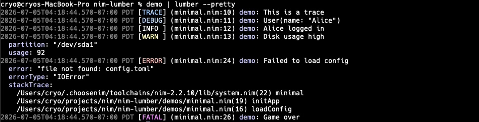

# lumber

[](https://github.com/cryo2010/nim-lumber/actions/workflows/ci.yml)

A compile-time optimized JSON logger for Nim with a built-in CLI prettifier.



## Features

- **Zero dependencies** - only uses the Nim standard library
- **Thread-safe** - safe for concurrent use from multiple threads
- **Compile-time level filtering** - log calls below the threshold are eliminated from the binary entirely, with zero runtime cost
- **Structured JSON output** - every log line is valid JSON with timestamp, level, name, filename, line number, and message
- **Structured messages** - named `key=value` arguments become discrete JSON fields, queryable by log aggregators
- **Exception logging** - pass any `ref Exception` and lumber extracts the message, type, and stack trace automatically
- **String interpolation** - `{0}`, `{1}` placeholders in messages are replaced with stringified arguments
- **Type-aware object formatting** - object types are automatically prefixed with their type name (e.g. `User(name: "Dude", age: 40)`)
- **Runtime level filtering** - per-logger level short-circuits immediately
- **Child loggers** - create derived loggers that inherit and extend the parent's context
- **Extra fields** - attach structured metadata to loggers, merged into every log line under an `"extra"` key
- **Thread-local context** - `withContext` attaches ambient fields to all loggers in the current call stack
- **Middleware** - a chain of functions that can enrich, transform, or suppress log records at runtime
- **Built-in middleware** - rate limiter, sampler, level-aware sampler, and redaction for production use
- **Multiple output streams** - write to stdout, files, or any custom `Stream` simultaneously
- **Rotating file streams** - built-in size-based and time-based file rotation
- **Buffered streams** - hybrid flush strategy (size, interval, and level threshold) for high throughput
- **Async stream wrapper** - non-blocking I/O via a background writer thread
- **Graceful shutdown** - automatic flush on exit, opt-in signal handling for SIGTERM/SIGINT
- **CLI prettifier** - pipe JSON logs through the `lumber` binary for colored, human-readable output with level filtering, field filtering, timezone support, and customizable format/colors via TOML config

## Installation

```
nimble install lumber
```

## Quick Start

```nim
import lumber

var logger = newLogger()
logger.info("Hello, world!")
```

> **Tip:** If you prefer namespaced access (`lumber.outputs`, `lumber.use`, etc.), use `from lumber import nil`. All examples below use plain `import lumber` for brevity.

Output:

```json
{"timestamp":"2026-07-03T00:00:00Z","level":"INFO","name":"mymodule","filename":"mymodule.nim","line":4,"message":"Hello, world!"}
```

## Compile-Time Level Filtering

Set the minimum log level at compile time with `-d:lumberLevel`. Calls below this level produce no code in the binary.

```sh
nim c -d:lumberLevel=WARN myapp.nim
```

With this flag, `logger.trace()`, `logger.debug()`, and `logger.info()` are completely eliminated -- arguments are type-checked but never evaluated at runtime.

Available levels (in order): `TRACE`, `DEBUG`, `INFO`, `WARN`, `ERROR`, `FATAL`

The default is `TRACE` (all levels enabled).

## API

### Creating a Logger

```nim
# Name defaults to the calling module's filename
var logger = newLogger()

# Named logger with extra context (JsonNode)
var logger = newLogger(name = "api", extra = %* {"service": "my-app"})

# Extra also accepts Nim objects — fields are serialized automatically
type AppContext = object
  service: string
  version: string

var logger = newLogger(name = "api", extra = AppContext(service: "my-app", version: "1.2.0"))
```

### Log Levels

```nim
logger.trace("Detailed tracing info")
logger.debug("Debug information")
logger.info("General information")
logger.warn("Warning")
logger.error("Error occurred")
logger.fatal("Fatal error")
```

### Runtime Level Filtering

Each logger has a `level` field that short-circuits before building the log record, running middleware, or serializing JSON.

```nim
var logger = newLogger(name = "api")
logger.level = LogLevel.WARN  # only WARN+ will be processed
logger.info("skipped")        # no work done
logger.error("processed")     # goes through normally
```

Child loggers inherit the parent's level.

### String Interpolation

Use `{0}`, `{1}`, etc. to interpolate arguments into the message. Extra arguments are appended.

```nim
logger.info("User {0} logged in from {1}", username, ipAddr)
logger.info("Values:", 1, 2, 3)  # "Values: 1 2 3"
```

### Structured Messages

Named arguments become discrete fields in the `extra` JSON object, keeping them queryable by log aggregators rather than buried in a text string.

```nim
logger.info("User logged in", user="alice", ip="10.0.0.1")
# extra: {"user": "alice", "ip": "10.0.0.1"}

# Mix positional interpolation with named fields
logger.info("Request {0} completed", reqId, status=200, latency=42)
# message: "Request req-abc completed", extra: {"status": 200, "latency": 42}
```

Message-level fields override logger extra on key collision:

```nim
var logger = newLogger(extra = %* {"user": "system"})
logger.info("login", user="alice")
# extra.user is "alice", not "system"
```

### Exception Logging

Pass any `ref Exception` as an argument — lumber automatically extracts the message, type name, and stack trace into structured fields.

```nim
proc loadConfig() =
  raise newException(IOError, "file not found: config.toml")

proc initApp() =
  loadConfig()

try:
  initApp()
except IOError as e:
  logger.error("Failed to load config", e)
```

Output:

```json
{"level":"ERROR","message":"Failed to load config","extra":{"error":"file not found: config.toml","errorType":"IOError","stackTrace":"app.nim(8) main\napp.nim(5) initApp\napp.nim(2) loadConfig\n"}}
```

The CLI prettifier renders stack traces on separate lines automatically:

```
[ERROR] (app.nim:10) api: Failed to load config
  error: "file not found: config.toml"
  errorType: "IOError"
  stackTrace:
    app.nim(8) main
    app.nim(5) initApp
    app.nim(2) loadConfig
```

Exceptions work as positional args or keyword args:

```nim
logger.error("Failed", e)                   # positional
logger.error("Failed", error=e)             # kwarg (key is ignored)
logger.error("Failed", e, retries=3)        # mixed with other fields
```

Multiple exceptions are stored as an array:

```nim
logger.error("Multiple failures", e1, e2)
# extra: {"errors": [{"error":"...","errorType":"...","stackTrace":"..."}, ...]}
```

### Timing Blocks

Measure the duration of a block and log it automatically with `duration_ms` in extra:

```nim
# Default: logs at INFO level
logger.time("db query"):
  db.exec("SELECT * FROM users")
# {"message":"db query","extra":{"duration_ms":12.34}}

# Custom level
logger.time(LogLevel.DEBUG, "template render"):
  renderPage()
```

The CLI prettifier displays duration inline after the message:

```
2026-07-03T15:00:00-07:00 PDT [INFO ] (app.nim:10) db: db query (12ms)
```

### Any Type as an Argument

Any type with a `$` operator can be passed. Objects are prefixed with their type name.

```nim
type User = object
  name: string
  age: int

var user = User(name: "Dude", age: 40)
logger.info("Found {0}", user)
# message: "Found User(name: \"Dude\", age: 40)"

logger.info(user)
# message: "User(name: \"Dude\", age: 40)"
```

### Child Loggers

Create child loggers that inherit the parent's name, level, and extra fields. Child extra fields are merged on top of the parent's.

```nim
var logger = newLogger(name = "api", extra = %* {"service": "my-app"})

var reqLogger = logger.child(extra = %* {"requestId": "abc-123"})
reqLogger.info("Handling request")
# extra: {"service": "my-app", "requestId": "abc-123"}

var dbLogger = reqLogger.child(name = "db", extra = %* {"query": "SELECT ..."})
dbLogger.error("Connection timeout")
# name: "db", extra: {"service": "my-app", "requestId": "abc-123", "query": "SELECT ..."}

# Child also accepts Nim objects
type DbContext = object
  host: string
  port: int

var dbLogger = reqLogger.child(name = "db", extra = DbContext(host: "db.local", port: 5432))
```

### Thread-Local Context

Use `withContext` to attach ambient fields that any logger on the current thread will pick up — without passing the logger through function calls.

```nim
var logger = newLogger(name = "api")

withContext(%* {"requestId": "abc-123", "userId": 42}):
  logger.info("handling request")
  # extra: {"requestId": "abc-123", "userId": 42}

  processOrder(order)  # any logger inside also sees requestId/userId

  # Nesting adds fields, restores on exit
  withContext(%* {"orderId": "ord-789"}):
    logger.info("processing payment")
    # extra: {"requestId": "abc-123", "userId": 42, "orderId": "ord-789"}

  logger.info("done")
  # extra: {"requestId": "abc-123", "userId": 42} — orderId is gone
```

Priority order (highest wins): message fields > logger extra > thread-local context.

### Middleware

Middleware functions receive a mutable `LogRecord` and return `true` to continue the chain or `false` to suppress the record.

```nim
# Enrich every log line
use proc(record: var LogRecord): bool =
  if record.extra.isNil:
    record.extra = newJObject()
  record.extra["env"] = %"production"
  true

# Suppress debug logs at runtime
use proc(record: var LogRecord): bool =
  record.level != "DEBUG"

# Clear all middleware
clearMiddleware()
```

The `LogRecord` type:

```nim
type LogRecord* = object
  timestamp*: string
  level*: string
  name*: string
  filename*: string
  line*: int
  message*: string
  extra*: JsonNode
```

### Built-in Middleware

Import `lumber/middleware` for ready-made middleware:

```nim
import lumber
import lumber/middleware
import std/re

# Rate limiter: allow max 5 messages per second from the same source location
use newRateLimiter(window = 1.0, maxBurst = 5)
```

When messages are suppressed, the next emitted message from that source location includes a `suppressed` field with the count of dropped messages:

```json
{"level":"INFO","message":"Event 11","extra":{"suppressed":7}}
```

```nim
# Sampler: log 1 in every 100 messages
use newSampler(rate = 100)

# Level sampler: sample DEBUG/TRACE at 1-in-50, always pass WARN+
use newLevelSampler(level = LogLevel.DEBUG, rate = 50)

# Redact sensitive fields using built-in defaults
use newRedactor()

# Override with a custom key list (replaces defaults entirely)
use newRedactor(@["password", "token", "ssn"])

# Redact values matching a regex pattern (e.g. credit card numbers)
use newPatternRedactor(re"\d{4}-\d{4}-\d{4}-\d{4}")

# Custom placeholder
use newRedactor(@["apiKey"], placeholder = "***")
```

Default redacted keys: `api_key`, `api_secret`, `apiKey`, `apiSecret`, `authorization`, `card_number`, `cardNumber`, `cookie`, `credit_card`, `creditCard`, `cvv`, `passwd`, `password`, `pin`, `secret`, `ssn`, `token`.

### Outputs and Routing

Each output has a `stream`, an optional `level` filter, and an optional `names` filter. By default, logs write to stdout at all levels.

```nim
import std/streams

outputs = @[
  # Console: all levels, all loggers
  Output(stream: newFileStream(stdout)),

  # File: only ERROR and above
  Output(stream: newFileStream("error.log", fmAppend), level: LogLevel.ERROR),

  # File: only logs from the "db" logger
  Output(stream: newFileStream("db.log", fmAppend), names: @["db"]),
]
```

The `Output` type:

```nim
type Output* = object
  stream*: Stream
  level*: LogLevel = LogLevel.TRACE  # default: accept all levels
  names*: seq[string] = @[]             # default: accept all logger names
```

### Rotating File Streams

#### Size-based rotation

Rotates when the file exceeds a size limit. Keeps numbered backups (`app.log.1`, `app.log.2`, etc.).

```nim
# 10MB max, keep 5 backup files (default)
Output(stream: newRollingFileStream("app.log"))

# Custom: 50MB max, keep 10 backups
Output(stream: newRollingFileStream("app.log", maxBytes = 50_000_000, maxFiles = 10))
```

#### Time-based rotation

Rotates at midnight UTC. Keeps dated backups (`app.2026-07-02.log`, `app.2026-07-01.log`, etc.).

```nim
# Keep 30 days of logs (default)
Output(stream: newDailyFileStream("app.log"))

# Keep 7 days
Output(stream: newDailyFileStream("app.log", maxFiles = 7))
```

### Buffered Streams

Wrap any stream with `newBufferedStream` for high-throughput logging. Uses a hybrid flush strategy inspired by Go's zap logger:

- **Flush on buffer full** — when accumulated data exceeds `maxSize` (default: 4096 bytes)
- **Flush on timer** — when `flushIntervalMs` has elapsed since last flush (default: 1000ms)
- **Flush on level** — immediately on ERROR or FATAL (configurable via `flushLevel`)
- **Flush on close** — always flushes remaining data

```nim
# Default settings (4KB buffer, flush every 1s or on ERROR+)
outputs = @[Output(stream: newBufferedStream(newFileStream(stdout)))]

# Custom: 8KB buffer, flush every 500ms, immediate flush on WARN+
outputs = @[Output(stream: newBufferedStream(
  newFileStream("app.log", fmAppend),
  maxSize = 8192,
  flushIntervalMs = 500,
  flushLevel = LogLevel.WARN
))]

# Combine with rotating files
outputs = @[Output(stream: newBufferedStream(newRollingFileStream("app.log")))]
```

In benchmarks, buffered streams are ~1.5-2.3x faster than unbuffered, with the gap widening with more outputs.

### Async Streams

Wrap any stream with `newAsyncStream` for non-blocking I/O. Log calls push data onto a channel and return immediately; a background thread handles the writes.

```nim
# Async console output
outputs = @[Output(stream: newAsyncStream(newFileStream(stdout)))]

# Async rotating file
outputs.add(Output(stream: newAsyncStream(newRollingFileStream("app.log"))))

# Close to flush and join the writer thread
for o in outputs:
  o.stream.close()
```

## CLI Prettifier

The `lumber` binary reads JSON log lines from stdin and prints colored, formatted output.

```sh
myapp | lumber
```

Output format:

```
2026-07-03T15:00:00-07:00 PDT [INFO ] (mymodule.nim:10) Server started {"service":"my-app"}
```

Levels are color-coded: TRACE (blue), DEBUG (light blue), INFO (white), WARN (yellow), ERROR (red), FATAL (magenta).

### Options

```
--level <level>       Minimum log level to display
--filter <expr>       Filter logs by field value (can be repeated)
--highlight <regex>   Highlight lines matching regex (can be repeated, alias: --hl)
--tz <timezone>       Timezone for timestamps (IANA name or abbreviation)
--format <template>   Output format template
--time-format <fmt>   Timestamp format using strftime specifiers
--pretty              Indent extra fields on separate lines
--no-color            Disable colored output (also respects NO_COLOR env var)
--config <path>       Path to config file
--init                Create default config file at ~/.config/lumber/config.toml
--help, -h            Show help
--version, -v         Show version
```

### Level Filtering

Filter output by minimum level:

```sh
myapp | lumber --level warn
myapp | lumber --level=error
```

### Field Filtering

Filter logs by field values using expressions. Filters match against top-level fields (`timestamp`, `level`, `name`, `message`) and `extra` fields. Multiple filters are ANDed together.

```sh
# Exact match
myapp | lumber --filter userId=1234

# Not equal
myapp | lumber --filter "env!=production"

# Numeric comparison
myapp | lumber --filter "latency>500"
myapp | lumber --filter "status>=400"

# Regex match
myapp | lumber --filter "path~^/api"
myapp | lumber --filter "message~timeout|refused"

# Timestamp filtering (supports UTC and offset formats)
myapp | lumber --filter "timestamp>2026-07-03T12:00:00Z"
myapp | lumber --filter "timestamp>2026-07-03T15:00:00-07:00"

# Combine multiple filters
myapp | lumber --filter userId=1234 --filter "latency>500"
```

### Highlighting

Highlight lines where any field value matches a regex. Unlike `--filter`, non-matching lines are still shown — matching lines get a background tint, and the matched text itself gets a brighter highlight. Matching is case-insensitive.

```sh
# Highlight a request ID across interleaved logs
myapp | lumber --highlight "req-7f3a"

# Short alias
myapp | lumber --hl "timeout|refused"

# Multiple patterns
myapp | lumber --hl "alice" --hl "error"
```

The background extends to the terminal's right edge. Highlight colors are configurable in the config file via `colors.highlight_line` (whole line background) and `colors.highlight_match` (matched text background). Both accept 256-color codes or named colors.

### Timezone Support

Timestamps are displayed in local time by default. Use `--tz` with an IANA timezone name or common abbreviation:

```sh
myapp | lumber --tz=UTC
myapp | lumber --tz=PST
myapp | lumber --tz=America/New_York
myapp | lumber --tz=JST
```

The displayed timestamp includes the UTC offset and abbreviated timezone name for clarity:

```
2026-07-03T15:27:17-07:00 PDT [INFO ] ...
2026-07-03T18:27:17-04:00 EDT [INFO ] ...
```

Non-JSON lines pass through unchanged.

### Output Format

Customize the output layout with `--format`. Available placeholders: `{timestamp}`, `{level}`, `{filename}`, `{line}`, `{name}`, `{message}`, `{duration}`, `{extra}`.

```sh
# Minimal output
myapp | lumber --format "{level} {message}"

# Without filename/line
myapp | lumber --format "{timestamp} [{level}] {name}: {message}{extra}"
```

### Timestamp Format

Customize how timestamps are displayed with `--time-format` using strftime specifiers:

```sh
# Time only
myapp | lumber --time-format "%H:%M:%S"

# Short date
myapp | lumber --time-format "%b %d %H:%M"
```

The default format is `%Y-%m-%dT%H:%M:%S`. The UTC offset and timezone abbreviation are always appended after the formatted time.

### Configuration File

Lumber looks for configuration in two places (later sources override earlier ones):

1. **Global**: `~/.config/lumber/config.toml` (respects `$XDG_CONFIG_HOME`)
2. **Project**: `.lumber.toml` in the current or any parent directory (walks up like `.git`)

Generate a default config file with `--init`:

```sh
lumber --init
```

Example config:

```toml
version = 1

[format]
template = "{timestamp} [{level}] ({filename}:{line}) {name}: {message}{duration}{extra}"
time_format = "%Y-%m-%dT%H:%M:%S"

[colors]
timestamp = "gray"
filename = "light_gray"
name = "cyan"
message = ""
duration = "gray"
extra_key = "cyan"
extra_value = ""
highlight_line = "236"
highlight_match = "240"

[colors.level]
trace = "blue"
debug = "light_blue"
info = "white"
warn = "yellow"
error = "red"
fatal = "magenta"

[options]
pretty = false
tz = "local"
level = "trace"
```

Available colors: `black`, `blue`, `cyan`, `gray`, `green`, `light_blue`, `light_cyan`, `light_gray`, `light_green`, `light_magenta`, `light_red`, `light_yellow`, `magenta`, `red`, `white`, `yellow`. Highlight colors also accept 256-color codes (e.g. `"236"`, `"240"`).

CLI flags always take precedence over config file values.

## Full Example

```nim
import lumber
import std/[json, streams]

type
  User = object
    name: string
    age: int

# Async console + rotating file + error-only file
outputs = @[
  Output(stream: newAsyncStream(newFileStream(stdout))),
  Output(stream: newRollingFileStream("app.log", maxBytes = 1_000_000, maxFiles = 3)),
  Output(stream: newFileStream("error.log", fmAppend), level: LogLevel.ERROR),
]

# Add request context via middleware
use proc(record: var LogRecord): bool =
  if record.extra.isNil:
    record.extra = newJObject()
  record.extra["env"] = %"production"
  true

var logger = newLogger(extra = %* {"service": "demo-api"})
var admin = User(name: "Admin", age: 35)

logger.info("Starting up")
logger.debug("Loading config for {0}", admin)

var reqLogger = logger.child(extra = %* {"requestId": "req-7f3a", "userId": 42})
reqLogger.info("Server listening on port {0}", 8080)
reqLogger.warn("Disk usage at {0}%", 92)

# Structured message fields
reqLogger.info("Request handled", status=200, latency=42, path="/api/users")

var dbLogger = reqLogger.child(name = "db", extra = %* {"host": "db.local", "port": 5432})
dbLogger.error("Failed to connect to database")

logger.fatal("Shutting down")

for o in outputs:
  o.stream.close()
```

## License

MIT
